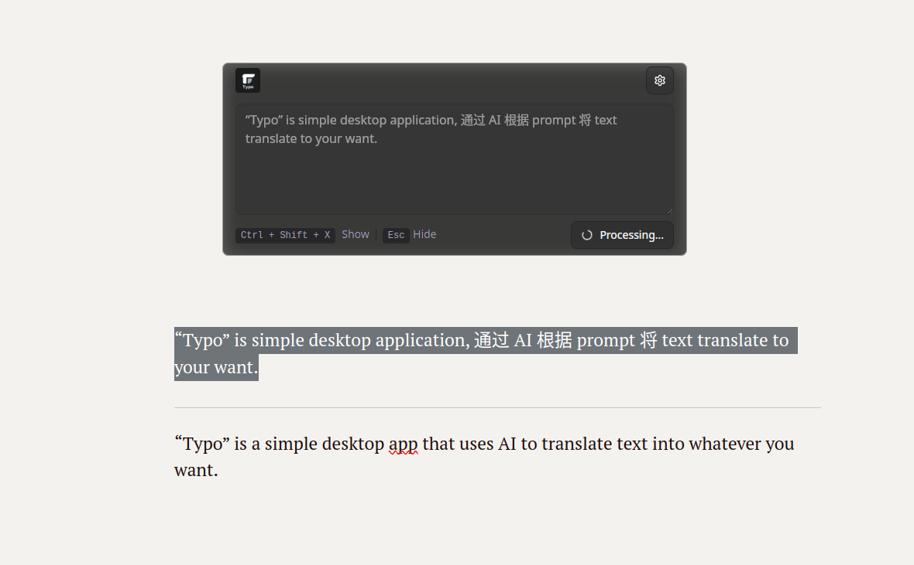

> [!WARNING]
> Still in early development

---

# typo

An AI-powered desktop tool that helps you write better English with smart suggestions and corrections.

## Screenshots



## Development

```bash
pnpm install
pnpm dev
```

## Usage

1. Select any text you want to improve
2. Press `Ctrl/Cmd + Shift + X` to open the AI interface
3. Wait for the response and replace the selected content

## Features

- Support for DeepSeek & Ollama AI models
- Global hotkey activation
- Real-time text processing

## FAQ

### macOS

- Enable accessibility permission for the app
- Run: `xattr -cr /Applications/typo.app`

### Ollma

- [Ollama API Documentation](https://github.com/ollama/ollama/blob/main/docs/api.md)

## Roadmap

- [ ] When the window appears, keep it centered, or position it near the current cursor location.
- [ ] Improve main window UI with streaming responses
- [ ] Core interaction optimization
- [ ] More settings available
- [ ] Add system tray menu
- [ ] Ctrl+1 to 5 for custom prompts
