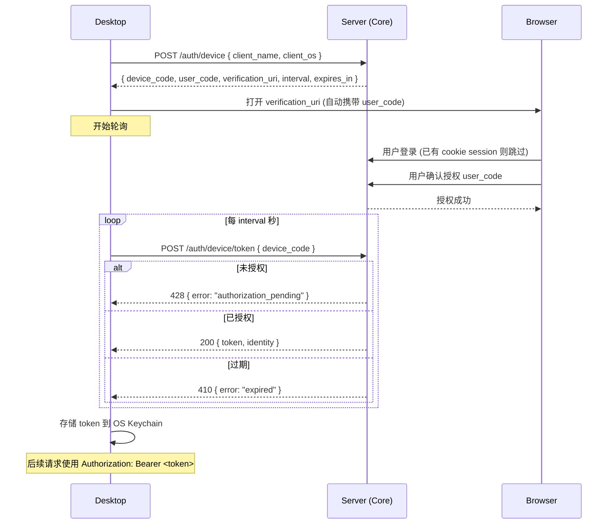

# Desktop Device Login

基于 [OAuth 2.0 Device Authorization Grant (RFC 8628)](https://datatracker.ietf.org/doc/html/rfc8628) 实现 Desktop 登录。

## 流程

## 数据模型

### 新增 `device_authorizations` 表

| 字段          | 类型     | 说明                                          |
| ------------- | -------- | --------------------------------------------- |
| `id`          | uuid     | 主键                                          |
| `device_code` | string   | 服务端验证用，不展示给用户                    |
| `user_code`   | string   | 展示给用户的短码，如 `TYPO-A3X9`              |
| `identity_id` | uuid     | 授权后关联                                    |
| `status`      | string   | `pending` / `approved` / `denied` / `expired` |
| `client_name` | string   | 如 "Typo Desktop v1.2.3"                      |
| `client_ip`   | string   | 请求来源 IP                                   |
| `expires_at`  | datetime | 15 分钟过期                                   |

### 扩展 `sessions` 表

| 新增字段       | 类型   | 说明                                          |
| -------------- | ------ | --------------------------------------------- |
| `client_type`  | string | `web` / `desktop`                             |
| `client_name`  | string | 如 "Typo Desktop v1.2.3 on macOS 15"          |
| `token_digest` | string | Desktop session 的 token 摘要 (Bearer 认证用) |

Web session 用 cookie 认证，Desktop session 用 Bearer token 认证，都存在同一个 `sessions` 表，Web 端可统一管理和撤销。

## 端点

| 方法     | 路径                     | 说明                        |
| -------- | ------------------------ | --------------------------- |
| `POST`   | `/auth/device`           | Desktop 发起设备授权请求    |
| `POST`   | `/auth/device/token`     | Desktop 轮询获取 token      |
| `GET`    | `/device`                | 用户验证页面 (短路径)       |
| `POST`   | `/device`                | 用户提交授权 (approve/deny) |
| `GET`    | `/settings/sessions`     | 查看所有 session            |
| `DELETE` | `/settings/sessions/:id` | 撤销指定 session            |

## 安全

- Token 只存 digest，明文仅创建时返回一次
- Desktop 端 token 存 OS Keychain（macOS Keychain / Windows Credential Manager / Linux Secret Service）
- `device_code` 使用高熵随机值，`user_code` 短码 + 15 分钟过期 + rate limit
- 轮询强制 `interval` 间隔，超频返回 429

## 实现任务

- [ ] Migration: 创建 `device_authorizations` 表
- [ ] Migration: `sessions` 表添加 `client_type`, `client_name`, `token_digest`
- [ ] Model: `DeviceAuthorization` (生成 code、过期、状态机)
- [ ] Model: `Session` 增加 `has_secure_token`、scope
- [ ] Controller: `Auth::DevicesController` (authorize + token 端点)
- [ ] Controller: `DevicesController` (用户验证页面)
- [ ] Controller: `Settings::SessionsController` (session 管理页面)
- [ ] Views: 设备验证页面、session 管理页面
- [ ] Tauri: `auth.rs` 模块 (发起授权 → 打开浏览器 → 轮询 → 存储 token)
- [ ] Tauri: Keychain 存储封装
- [ ] Tauri: API client Bearer token 注入，401 时清除登录态
